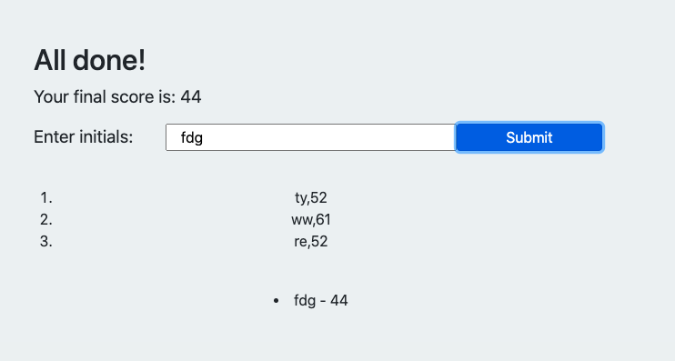

# Coding-Quiz

This coding quiz poses the user with a  range of questions. 
If the user answers the questions correctly, no penalty occurs, and they are shown the next question. If the user answers the question incorrectly, they lose 5 seconds off their time, and the next question is shown. Once all 5 questions are answered, or the timer runs out (whatever occurs first), the game ends. 

The user enters their initials and can view their high scores by clicking the high score button. They can then choose to clear their high scores or take the quiz again.

When adding the high score, I could not figure out how to get all scores into an order, and without the dot point (shown below). This is something I would work on if I was to continue to develop this application. 

